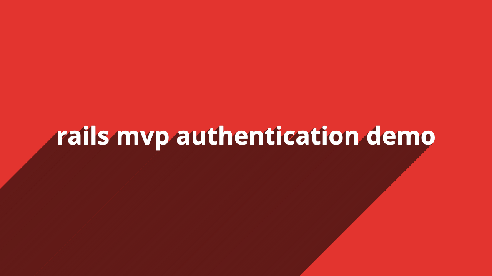

# 🔐 Rails MVP Authentication

An authentication generator for Rails 7. Based on the [step-by-step guide on how to build your own authentication system in Rails from scratch](https://github.com/stevepolitodesign/rails-authentication-from-scratch).

## 🎬 Demo

<a href="https://youtu.be/vhZoBoOj0ok">

</a>

## 🚀 Installation

Add this line to your application's Gemfile:

```ruby
gem "rails_mvp_authentication"
```

And then execute:
```bash
bundle
```

Or install it yourself as:
```bash
gem install rails_mvp_authentication
```

Then run the installation command:
```bash
rails g rails_mvp_authentication:install
```

Once installed make follow these steps:

1. Run `bundle install` to install [bcrypt](https://rubygems.org/gems/bcrypt/)
2. Run `rails db:migrate` to add the `users` and `active_sessions` tables
3. Add a root path in `config/routes.rb`
4. Ensure you have flash messages in `app/views/layouts/application.html.erb`

```html+erb
<p class="notice"><%= notice %></p>
<p class="alert"><%= alert %></p>
```

After completing these steps you can uninstall the gem:

```bash
bundle remove "rails_mvp_authentication" --install
```

## 📝 Features

- Requires a user to confirm their email address before they can log in.
- Allows a user to remain logged into the application even if they exit their browser.
- Allows a user to have multiple sessions. This gives users the ability to log out of all sessions at once. This also makes it easy to detect suspicious login activity.
- Allows a user to change their email address.
- Allows a user to recover their account if they forget their password.
- Requires users to submit their password anytime they're chaning their account information.

## 🔨 Usage

The following methods are automatically included in the corresponding generated files.

### Controller Methods 

#### authenticate_user!

Redirects the visitor to the `login_path` if they're not logged in. Useful for preventing an anonymous user from accessing a page intended for an authenticated user.

#### current_user

Returns an instance of `User` if there's one in the session. Othwerwise returns `nil`.

#### forget_active_session

Deletes the `:remember_token` cookie. For added security, the associated `active_session` should be deleted too.

#### login(user)

[Resets](https://api.rubyonrails.org/classes/ActionDispatch/Request.html#method-i-reset_session) the session and then creates a new `active_session` with on the `user` that was passed in. Stores the `id` of the `active_session` in the `session`. Returns the new `active_session`.

#### logout

[Resets](https://api.rubyonrails.org/classes/ActionDispatch/Request.html#method-i-reset_session) the session and deletes the associated `active_session` record.

#### user_signed_in?

Returns `true` if `current_user` does not return `nil`. Othwerwise returns `false`.

#### redirect_if_authenticated

Redirects the user to the `root_path` if the user is logged in. Useful for keeping a user from accessing a page intended for an anonymous user.

#### remember(active_session)

Creates a cookie to store the value of the `remember_token` from the `active_session` that was passed in. 

### View Helpers

#### current_user

Returns an instance of `User` if there's one in the session. Othwerwise returns `nil`.

#### user_signed_in?

Returns `true` if `current_user` does not return `nil`. Othwerwise returns `false`.

### User Model

#### self.authenticate_by(attributes)

A copy of the [authenticate_by](https://edgeapi.rubyonrails.org/classes/ActiveRecord/SecurePassword/ClassMethods.html#method-i-authenticate_by) class method that is set to ship in rails 7.1

#### confirm!

Sets the `confirmed_at` column to `Time.current`. Updates the `email` column if reconfirming a new email address. Returns `true` or `false`.

#### confirmed?

Returns `true` or `false` based on if the `confirmed_at` column is present.

#### confirmable_email

Returns the value of the `email` column if the `unconfirmed_email` column is empty. Otherwise, the value of `unconfirmed_email` is returned.

#### generate_confirmation_token

Generates a [signed_id](https://api.rubyonrails.org/classes/ActiveRecord/SignedId.html#method-i-signed_id) used in the confirmation mailer.

#### generate_password_reset_token

Generates a [signed_id](https://api.rubyonrails.org/classes/ActiveRecord/SignedId.html#method-i-signed_id) used in the password reset mailer.

#### send_confirmation_email!

Send a confirmation email to the user.

#### send_password_reset_email!

Send a password reset email to the user.

#### reconfirming?

Returns `true` if there's a value for `unconfirmed_email`. Otherwise `false` is returned.

#### unconfirmed?

Returns `true` if there's no value for `confirmed_at`. Otherwise `false` is returned.

#### unconfirmed_or_reconfirming?

Returns `true` if the user is unconfirmed or reconfirming a new email address. Otherwise `false` is returned.

### Test Helpers

#### current_user

Returns an instance of `User` if there's one in the test session. Othwerwise returns `nil`.

#### login(user, remember_user: nil)

Creates a `post` request to the `login_path`. Simulates a real login. 

#### logout

Deletes the `current_active_session_id` test session. Simulates a login.

## ⚖️ Benefits

What makes this gem _different_ (not better) from [devise](https://github.com/heartcombo/devise), [clearance](https://github.com/thoughtbot/clearance/), etc?

1. This gem is less of an [engine](https://guides.rubyonrails.org/engines.html) and more of a [generator](https://guides.rubyonrails.org/generators.html). It generates all necessary models, views, controllers, mailers, and migrations. This means you have complete control over your authentication system and don't have to worry about learning a new DSL or API.
2. It also generates tests. That way you can ship with confidence if and when you decide to change how your authentication system works.
3. It utilizes modern core features of Rails, such as [ActiveSupport::CurrentAttributes](https://api.rubyonrails.org/classes/ActiveSupport/CurrentAttributes.html) and [Active Record Signed Id](https://api.rubyonrails.org/classes/ActiveRecord/SignedId.html#method-i-signed_id), [has_secure_password](https://api.rubyonrails.org/classes/ActiveModel/SecurePassword/ClassMethods.html#method-i-has_secure_password) and [has_secure_token](https://api.rubyonrails.org/classes/ActiveRecord/SecureToken/ClassMethods.html#method-i-has_secure_token).
4. It stores the session in the database. This gives users the ability to log out of all sessions at once. This also makes it easy to detect suspicious login activity.

## 🙏 Contributing

If you'd like to open a PR please make sure the following things pass:

```ruby
bin/rails test
bundle exec standardrb
```
## 📜 License

The gem is available as open source under the terms of the [MIT License](https://opensource.org/licenses/MIT).
